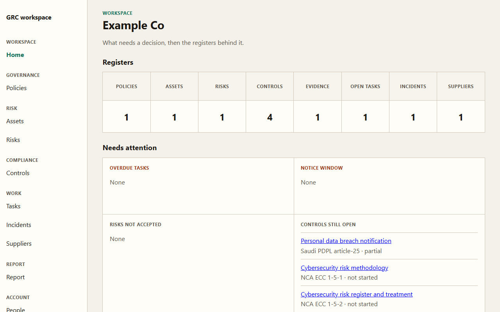

# GRC workspace



A lite governance, risk, and compliance register for one organization, aimed at a GCC SME. It is a local system of record: a person writes the registers, and the app keeps them in one place.

The loaded framework packs are NCA ECC, SAMA CSF, and Saudi PDPL. Control titles in the app are workspace labels, not official control text. The app does not file notices and it does not give legal advice.

## What it keeps

- Policies.
- Assets, third parties, business units, and processes, used as the context for a risk.
- A risk register with the trigger, response, treatment, residual risk, appetite note, and owner acceptance. Triggers are a project, a critical change, outsourcing, a new product, or a periodic review.
- A statement of applicability, evidence on a control, and tasks with an owner and a due date.
- Incidents, including who may respond, what was done, the lessons, and Saudi PDPL breach-notice fields. When personal data may be harmed and the time the team became aware is recorded, the incident page shows whether the 72-hour notice window is still open.
- A supplier review that can be stored only when it was done before the contract.
- An HTML report and a CSV export.
- Two roles: an admin, who can rename the organization, manage people, and delete records, and a member, who can keep the registers.

The home page is a register line and an attention grid: overdue tasks, incidents still inside the notice window, risks the owner has not accepted, and applicable controls that are partial or not started.

## Run

Requires Python 3.12 or newer and [uv](https://docs.astral.sh/uv/).

```bash
uv sync
uv run grc
```

Open http://127.0.0.1:8000. A new database is created at `data/grc.sqlite`. The server listens on `127.0.0.1` unless `GRC_HOST` is set.

Local demo accounts, created only when the database is empty:

- Admin: `admin@localhost` / `admin-change-me`
- Member: `member@localhost` / `member-change-me`

Change those passwords from the Password page before anyone else can reach the machine.

## Configuration

The process reads these variables from the environment. None are required.

| Variable | Purpose |
| --- | --- |
| `GRC_DB` | Database file. Default `data/grc.sqlite`. |
| `GRC_SESSION_SECRET` | Session signing key. If unset, the app writes `session.key` beside the database. |
| `GRC_HOST` | Bind address. Default `127.0.0.1`. |
| `PORT` | Port. Default `8000`. |

Keep `data/` and `session.key` out of git. `.gitignore` also ignores `.env`, other `.env.*` files, and any `*.sqlite` file.

## Local data

The default database is `data/grc.sqlite`. Uploaded evidence is stored in `data/evidence/`. If `GRC_SESSION_SECRET` is not set, the app writes `session.key` in the same folder as the database. Those files are local. They are not part of the source. If you upload this folder by hand, leave `data/` behind. If `GRC_DB` points somewhere else, the database, evidence, and session key are written there instead. The picture in this readme is a sample workspace named Example Co, built with the demo accounts. It is not a customer record.

The demo passwords are published on purpose so a new local database can be opened. Change them before anyone else can reach the machine. The server listens on localhost unless `GRC_HOST` is changed.

## Tests

```bash
uv run pytest
```

## Not in this version

Model drafts, continuous evidence collection, audit rooms, multi-entity administration, connectors, email, and numeric or FAIR risk scores.

## Images

`assets/` holds the pictures for GitHub. `social-preview.png` is the repository social preview. `logo.png` is a square mark. `home.png` is the picture above.

## Author

Majid Mumtaz, Director of Internal Audit and Risk Advisory. CIA, ACA, FCCA, ACCA, GRCP, GRCA, and COSO ERM Certified.

- GitHub: [majidrajpar](https://github.com/majidrajpar)
- LinkedIn: [majid-m-4b097118](https://www.linkedin.com/in/majid-m-4b097118/)
- Portfolio: [majidrajpar.github.io/portfolio_my](https://majidrajpar.github.io/portfolio_my/)
- YouTube: [@AuditBitz](https://www.youtube.com/@AuditBitz)

The About page in the app uses this name, role, credentials, and these links.

## License

MIT. Copyright (c) 2026 Majid Mumtaz. See [LICENSE](LICENSE). Contributions follow [CONTRIBUTING.md](CONTRIBUTING.md).
